# FocusZen AI • Immersive Deep Work & Cyber-Wellness Portal

FocusZen AI is a dark, futuristic, high-fidelity productivity dashboard and cognitive-realignment portal. Designed with state-of-the-art glassmorphism aesthetics, neon HUD interfaces, and ambient synthesizer integration, it shields users from digital noise while mapping cognitive coherence, workflow streaks, and wellness metrics in real time.

---

## 📱 Immersive Interface Showcase

### 1. Productivity Hub (Home Dashboard)
*Discover a unified holographic interface designed to shield you from digital noise and align focus:*

| Home Dashboard Top | Home Dashboard Bottom | AI Coach Chat |
| :---: | :---: | :---: |
| 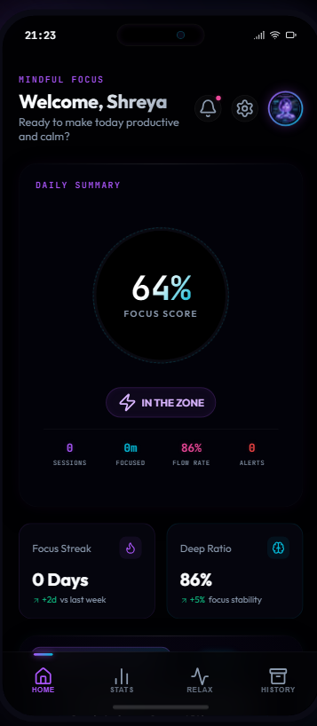 | 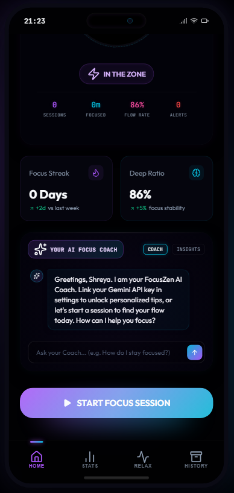 | 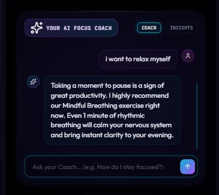 |

---

### 2. Cognitive Analytics & Progression (Stats)
*Track your workflow coherence, achievements, and focus telemetry in real-time:*

| Analytics Overview | Milestones & Badges Grid | Focus Trends & Patterns |
| :---: | :---: | :---: |
| 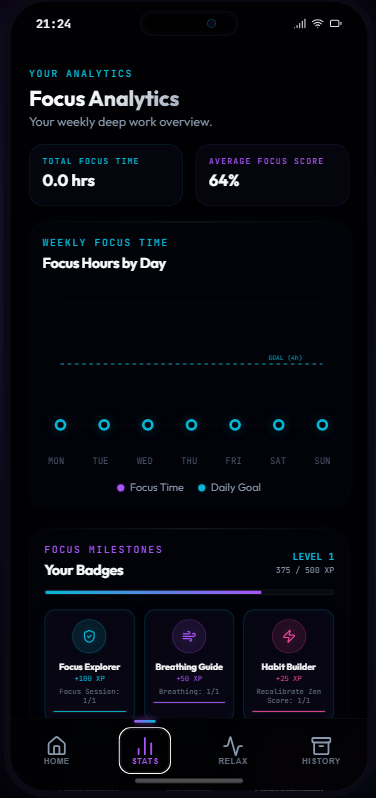 | 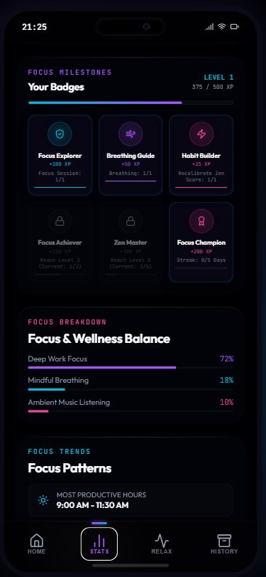 | 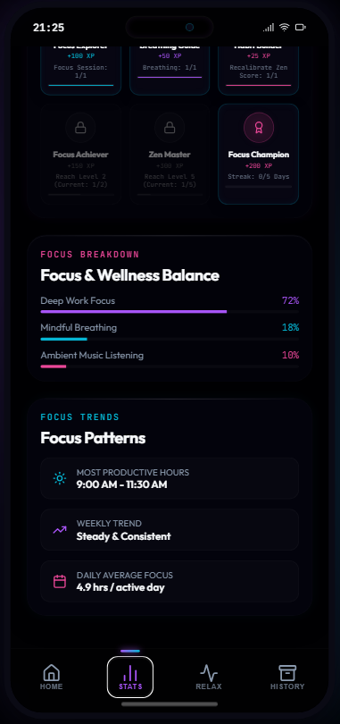 |

---

### 3. Cyber-Wellness & Relaxation Portal (Relax)
*Procedural ambient soundscapes and paced biometric chest box-breathing guides:*

| Mindful Breathing Orb | Ambient Soundscape Control |
| :---: | :---: |
| 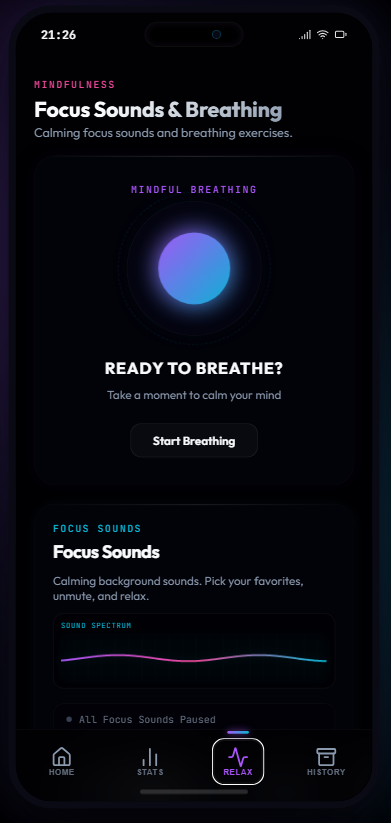 | 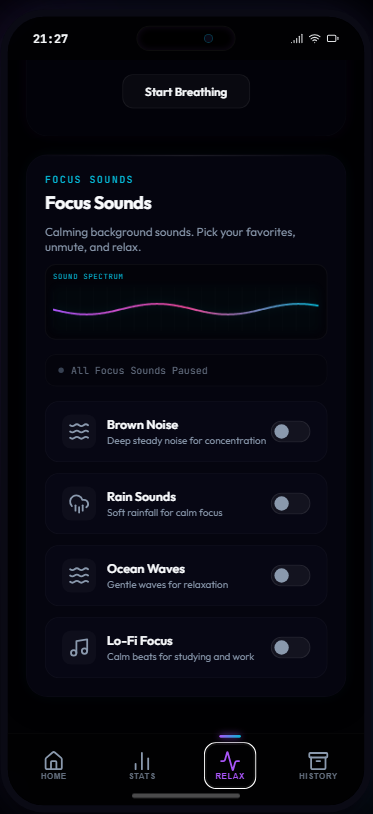 |

---

### 4. History Loggers & Configuration Panel
*Zero-loss state persistence, dynamic alert feeds, and Gemini API setup:*

| Immersive Focus History | Alerts & Notifications | Futuristic App Settings |
| :---: | :---: | :---: |
| 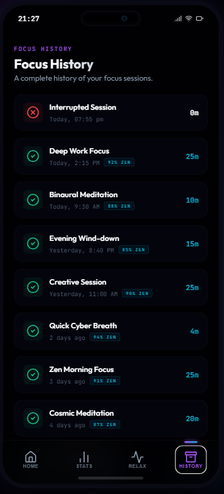 | 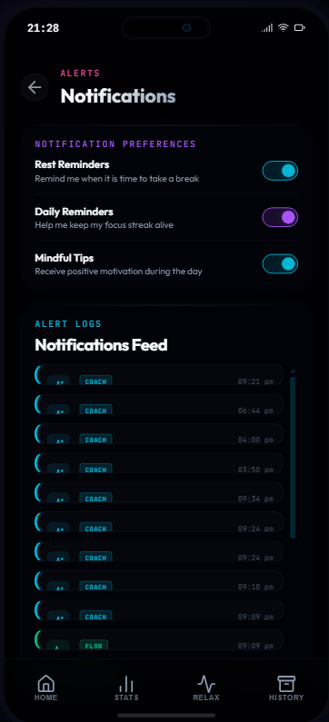 | 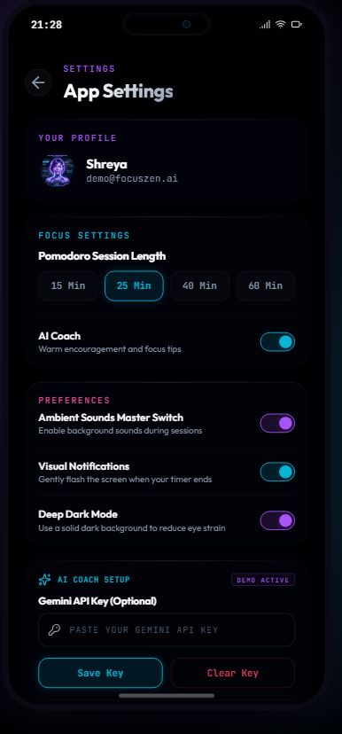 |

---


## 🚀 Key Features & Architectural Uplinks

### 1. Immersive Guided Breathing Portal
A fullscreen cosmic alignment environment featuring a calming, dynamic neon breathing orb that scales and transforms organically:
* **Interactive 4-Phase Box Breathing**: Paces users through Inhale (4s), Hold (4s), Exhale (4s), and Hold/Empty (4s) states with real-time guided countdown timers and visual glows.
* **Volumetric Web Audio Sound Guides**: Generates procedural oscillator tones in real time:
  * *Inhale*: Sine wave sweeps pitch up from `220Hz` to `440Hz` with swelling volume envelopes.
  * *Hold*: Emits a soft holding tone at `440Hz` with a subtle `1.5Hz` LFO pitch vibrato.
  * *Exhale*: Sweeps pitch down from `440Hz` to `220Hz` with exponential amplitude decay.
  * *Empty Hold*: Synthesizes a soft, bandpass-filtered noise wind simulating steady airflow.

### 2. Gamified Holographic Achievements & XP System
* **Progression Registry**: Tracks user experience points (XP), active Levels, and Unlocked Badges in local state with full `localStorage` persistence.
* **XP Accumulation**: Completed focus sessions award `+100 XP`, breathing cycles award `+25 XP`, and audio meditation awards `+20 XP`. Users level up every `500 XP`.
* **Holographic Cards Grid**: Displays 6 glowing, interactive cyberpunk badges on the Stats dashboard. Unlocked badges spin and glow in HSL neon gradients, while locked badges remain grayed-out glassmorphic shells.
* **Unlock Popups & Chimes**: Unlocking achievements triggers a rapid, arpeggiated procedural C major chime sweep and slides down a custom neon toast banner.

### 3. Procedural Audio Synthesizer Engine (Zero Assets)
Generates high-fidelity ambient wellness loops directly in the browser using the HTML5 Web Audio API:
* **Brown Noise**: Warm, integrated lowpass-filtered noise for full frequency masking.
* **Rain Sounds**: Bandpass-filtered random impulses and slow wind sweeps for deep rain realism.
* **Forest Ambience**: Layered low-frequency wind rustles and randomized procedural bird chirps sweeping pitch.
* **Ocean Waves**: Slow, dual-modulator LFO swelling noise waves with corresponding lowpass frequency shifts.
* **Café Background**: Coziest room acoustics with randomized high-frequency ceramic plate and cup clink impulses.
* **Lo-Fi Focus**: Cozy minor-seventh chord arpeggiations, smooth bass nodes, and slow vinyl crackle triggers.
* **Deep Ambient**: Lush synthetic pads arpeggiated over triangle/sine waves with 12s resonant lowpass filters.
* **Combined Real-Time Visualizers**: Routes all active audio nodes through a central `AnalyserNode` connected to dynamic CSS-responsive canvases (`#sound-visualizer-canvas` in Zen screen and `#portal-visualizer-canvas` in Focus Portal) to render real-time frequency spectrograms.

### 4. Smart Pomodoro Focus Portal
* **Immersive Focus Mode**: A full-screen dark HUD displaying circular countdown rings and paced chest box breathing rings.
* **State Recovery Protection**: Restores active session progress and paused intervals immediately upon browser tab reloads, preventing timing glitches.
* **Zero-Loss Auto-Save**: Auto-saves focus sessions immediately when the timer reaches `0:00`, logging stats, updating streaks, and calculating performance trends.
* **Dynamic Analytics**: Draws interactive SVG spline graphs with custom area gradients and hovering coordinate overlays using real completed session logs.

### 5. Bezel-Dissolving Mobile Responsiveness
* **Universal Scaling**: Uses modern media queries to detect mobile screen viewports.
* **Outer Bezel Dissolution**: On screens smaller than `500px`, the mock smart phone shell borders, dynamic islands, and iOS home bars dissolve completely, expanding the glassmorphic content to cover the mobile screen edge-to-edge.
* **Touch Optimization**: Sets minimum touch targets for nav buttons, sliders, and duration selectors to `44x44px` for natural mobile gestures.

---

## 🛠️ Tech Stack Wires

* **Structure**: Semantic HTML5 markup
* **Sensory Design**: Vanilla CSS3 Custom Variables (HSL tailored neon tokens, glassmorphic filters, keyframe slide transitions)
* **Logic & Synthesis**: Vanilla ES6+ Javascript (HTML5 Web Audio API, Canvas 2D Rendering Context, SVG Cubic Splines, LocalStorage State Engines)
* **Iconography**: Lucide Icons (Crisp, vector-based glowing iconography)
* **AI Intelligence Core**: Google Gemini REST APIs (via REST fetch client)

---

## 🚀 Quick Setup & Local Launch

FocusZen AI is designed to run 100% serverless, requiring zero database installs or complex compilation steps.

### Option 1: Live Local Server (Recommended)
1. Ensure you have **Node.js** installed on your system.
2. Open your terminal in the project directory.
3. Start a static server:
   ```bash
   npx http-server -p 8888 -c-1
   ```
4. Open your browser and navigate to: **[http://localhost:8888](http://localhost:8888)**

### Option 2: Serverless Double-Click Launch
1. Double-click `index.html` on your computer.
2. Note: For full Web Audio permission support and REST calling, running a local HTTP server (Option 1) is highly recommended.

---

## 💎 Production Ready & Deployment

The codebase is fully optimized for one-click deployment on **Vercel** or **Netlify**:

### Vercel Deployment Wires:
1. Initialize a Git repository in the root directory:
   ```bash
   git init
   git add .
   git commit -m "Initialize FocusZen AI Release Core"
   ```
2. Connect to GitHub and import the repository into Vercel.
3. Vercel will automatically detect the static project. Simply click **Deploy**.
