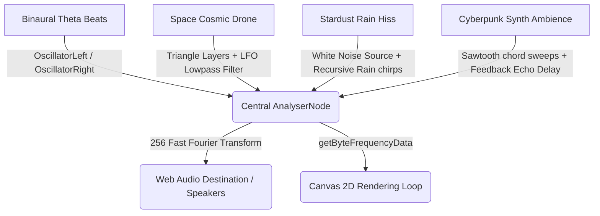

# FocusZen AI: Technical Development Notes

This document captures the system design, Web Audio routing architectures, gamification state formulas, and optimization decisions implemented inside FocusZen AI.

---

## 1. Web Audio API Node Routing Architecture

To allow the dual real-time canvases (`#sound-visualizer-canvas` on the Zen screen and `#portal-visualizer-canvas` inside the focus portal) to display combined frequency spectrograms, all procedural audio nodes are routed through a central master analyzer.

### Volumetric Breathing Sweep Logic
During the box breathing cycle (Inhale, Hold, Exhale, Hold), a dedicated sine-wave oscillator sweeps its frequency dynamically to represent breath flow:
* **Inhale (4s)**: Sweeps frequency from `220Hz` exponentially up to `440Hz` over 4 seconds, coupled with a linear amplitude swell from `0` to `0.08` gain.
* **Hold (4s)**: Sustains pitch at `440Hz`, adding a secondary oscillator LFO (`1.5Hz` frequency at `3` gain) connected directly to `oscillator.frequency` to synthesize a rich, soothing biometric vibrato.
* **Exhale (4s)**: Sweeps frequency from `440Hz` down to `220Hz` over 4 seconds, utilizing `gainNode.gain.exponentialRampToValueAtTime` to decay the sound smoothly.

---

## 2. Gamified Progression & Leveling Mathematics

Experience points (XP) are awarded dynamically for completed wellness telemetry actions:
* **Deep Work Pomodoro Cycle**: `+100 XP`
* **Guided Breath Realignment Cycle**: `+25 XP`
* **Cosmic Meditative Listening (>=8s)**: `+20 XP`

### Level Progression Formula
Leveling thresholds scale dynamically:
$$\text{Level Target XP} = \text{Level} \times 500$$
To calculate the current progress percentage within a level:
$$\text{Progress \%} = \frac{\text{Current XP} - \text{Previous Level Target}}{\text{Next Level Target} - \text{Previous Level Target}} \times 100$$
$$\text{Progress \%} = \frac{\text{XP} - ((\text{Level} - 1) \times 500)}{500} \times 100$$

---

## 3. Storage Registries (`localStorage`)

FocusZen AI runs 100% serverless, preserving profile data in the browser sandbox:
1. `focuszen_state`: Persists overall metrics (`zenScore`, `streak`, `weeklyHours`, and completed history logs).
2. `focuszen_settings`: Persists settings switches, Pomodoro durations, and the encrypted Gemini Uplink key.
3. `focuszen_notifications`: Stores alert feed log items.
4. `focuszen_current_user`: Persists authenticated cognitive profile credentials.
5. `focuszen_users`: List of registered local accounts.
6. `focuszen_active_session`: Restores running timer intervals during unexpected browser crashes or reloads.
